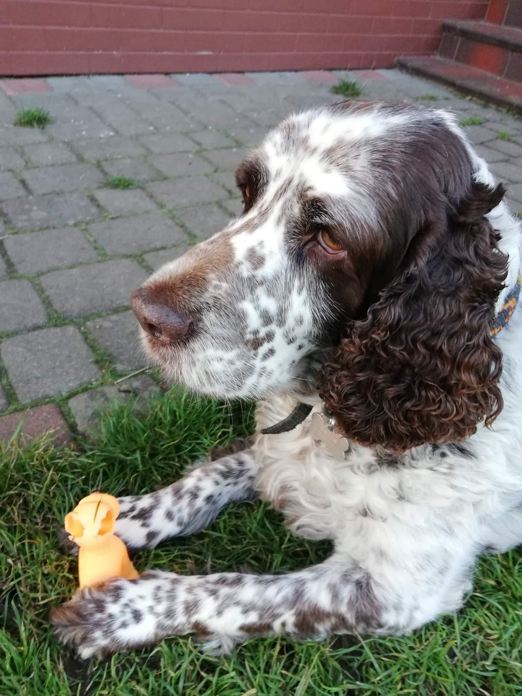
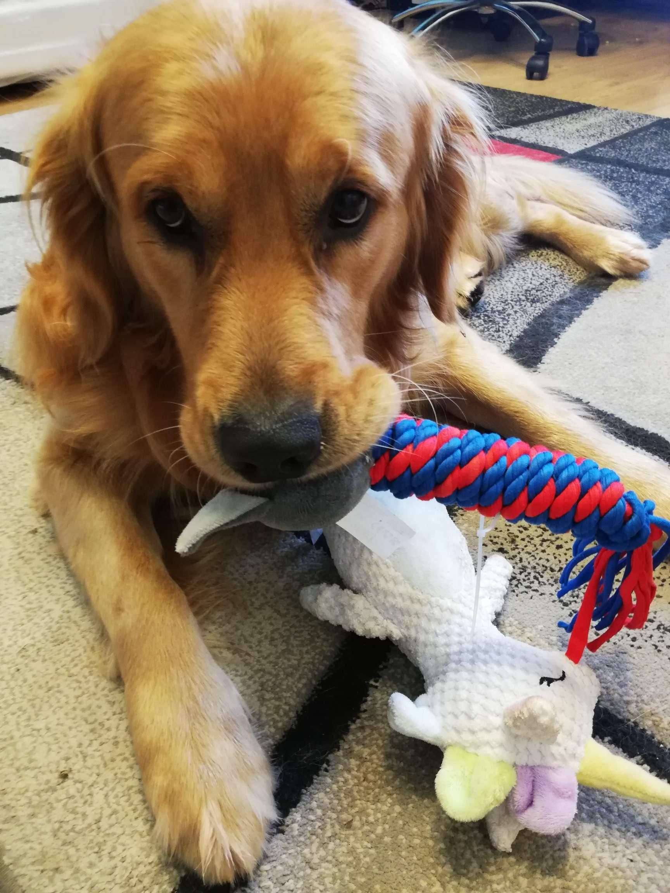
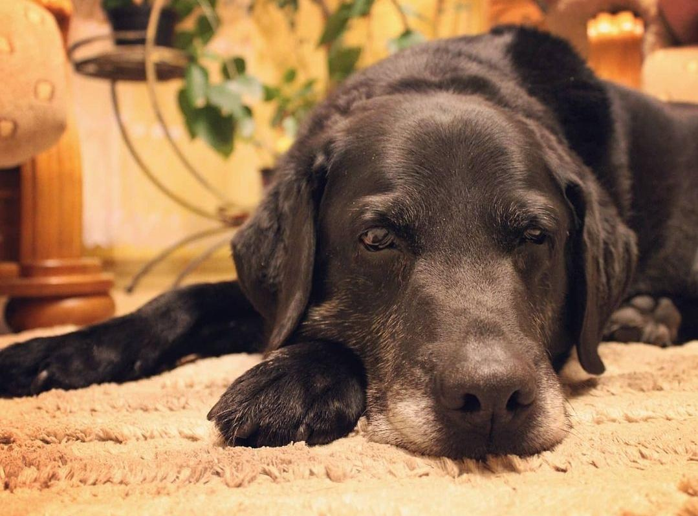

# Hello, I'm Artur 👋

I'm a student at University of Warsaw studying Computer Science.  
I'm also a mid C++ developer.  

## 🛠 Technologies and Tools I use:

## 🐾 Meet My Dogs
I love spending time with my pet friends. Here are my three dogs:

  
[Bela] loves sleeping and food.

  
[Libert] very energetic, loves to push everyone of the couch.

  
[Toro] a senior who loves napping and greeting everyone who he sees.

## Connect with me 🌎
- [LinkedIn](https://www.linkedin.com/in/artur-kamieniecki-380425236/?originalSubdomain=pl)
